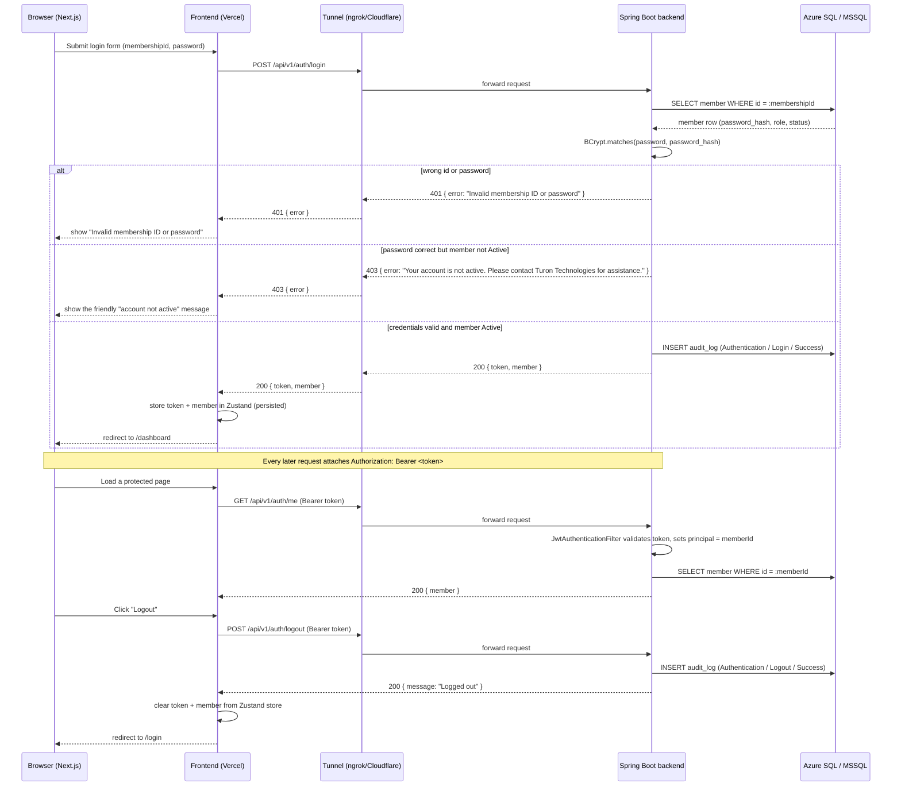
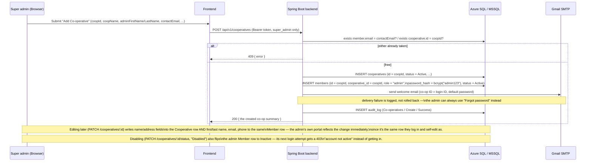
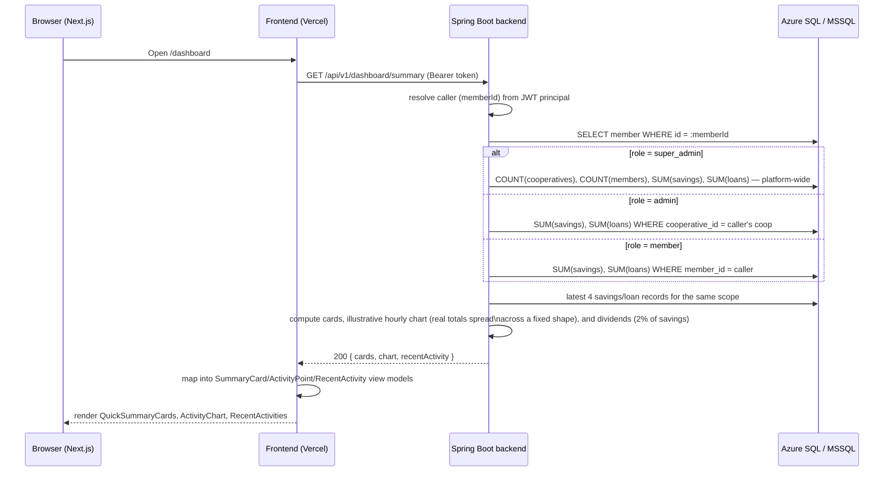
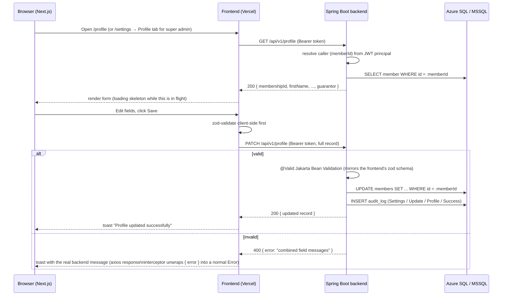
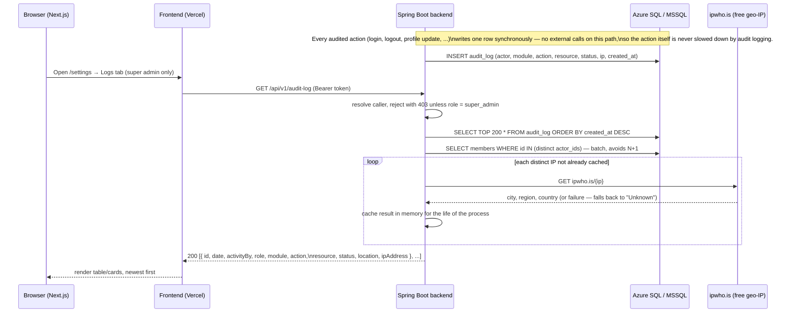

# Request flows

Sequence diagrams for the flows the frontend now calls for real:
authentication (login/me/logout), the dashboard summary, profile
view/edit, and the audit log.

## Auth flow



JWTs are stateless, so `/auth/logout` has nothing server-side to invalidate
today — it exists so logout is audit-logged and so the frontend always has
one call to make regardless of auth strategy. The token is discarded
client-side either way; if token revocation is ever needed, this endpoint is
where a blacklist check would be added.

**Any 401 from any endpoint (except `/auth/login` itself) forces the user
back to `/login`.** This is handled once, centrally, in the frontend's axios
response interceptor (`t-coop-app/src/lib/axios.ts`) — it clears the
Zustand auth store and hard-redirects, so an expired/invalid token on *any*
page (not just auth endpoints) recovers cleanly instead of showing a broken
page with failed requests. `/auth/login`'s own 401 (wrong password) is
excluded from this so a failed login attempt doesn't bounce the user in a
loop — that case is handled by the login form itself. This depends on 401
responses actually carrying CORS headers even when Spring Security
generates them directly (see api-conventions.md § CORS) — without that, the
browser reports a CORS failure instead of a 401 and this redirect never
fires.

## Co-operative onboarding flow

A co-op **is** its admin account — onboarding creates one `Cooperative` row and exactly one
`Member` row (`role: "admin"`) sharing the same `id`, so the co-op logs in as itself.



Nothing about this generates a second, separate `AD-XXXX` admin ID — the co-op ID *is* the
membership ID an admin logs in with, using the platform default password (`admin123`) until
they change it. This makes "how many co-ops has super admin onboarded" and "how many admin
accounts exist" the same number by construction, and every `Member` row with
`cooperativeId` = that co-op's id (role `admin` or `member`) is exactly that admin's roster.

## Subscription lifecycle flow

A co-op can act on the platform only while its subscription is paid up (`SubscriptionGateFilter`
enforces this on every mutating request platform-wide) — including a co-op that has *never*
paid, not just one that lapsed. There are two ways to pay: the super admin records a payment
they witnessed happen externally, or the co-op's own admin pays for real via Paystack/
Flutterwave/OPay from `/support` (the one page a dormant admin can still reach).

```mermaid
sequenceDiagram
    participant Admin as Co-op admin (Browser)
    participant F as Frontend
    participant B as Spring Boot backend
    participant GW as Paystack/Flutterwave (client-side widget)
    participant DB as Azure SQL / MSSQL

    Note over Admin,DB: Every write Admin attempts anywhere else in the app gets 402\n"subscription expired" from SubscriptionGateFilter until this succeeds.

    Admin->>F: Open /support, pick a plan (from the super admin's own Subscription\nPlans catalog) + gateway
    F->>B: GET /api/v1/subscriptions/me
    B->>DB: SELECT subscription_plans WHERE type = (New Subscription | Renewal) AND status = Active
    B-->>F: availablePlans (label/duration/amount, scoped to this co-op's state),\navailable gateways + PUBLIC keys (from PlatformSettings)

    Admin->>F: Click "Pay"
    F->>B: POST /api/v1/subscriptions/me/initialize { planId, gateway }
    B->>DB: INSERT subscription_payment_intents (reference, plan's own amount/label/duration, gateway, Pending)
    B-->>F: { reference, amount, publicKey }

    F->>GW: Open Inline checkout (publicKey, amount, reference)
    GW-->>Admin: Real checkout UI
    Admin->>GW: Pays
    GW-->>F: Client-side success callback (reference)

    F->>B: POST /api/v1/subscriptions/me/confirm { reference }
    B->>GW: GET transaction verify (reference) — server-side, using the SECRET key from PlatformSettings
    GW-->>B: { status: success, amount }
    B->>B: amount must be >= the intent's own amount — never trusts the client's number
    B->>DB: INSERT subscription_payments (type auto-detected: New Subscription | Renewal)
    B->>DB: UPDATE cooperatives SET subscription_cycle, subscription_expires_at
    B->>Admin: Emails a receipt (amount, type, cycle, next renewal date)
    B-->>F: SubscriptionReceiptDto
    F-->>Admin: Branded receipt (on-screen + downloadable PDF); dashboard's "expired" banner\nand /support redirect both clear on the next session refresh
```

**OPay is a third gateway option with a different shape from the diagram above** — it's
server-initiated/redirect-based, not a client-side inline widget:
- `POST /subscriptions/me/initialize { gateway: "Opay" }` has the *backend itself* call OPay's
  real `cashier/create` API and returns a hosted `checkoutUrl` instead of a `publicKey`.
- The frontend just navigates the browser to that `checkoutUrl` (`redirectToOpayCheckout` in
  `src/lib/opay.ts`) — there's no widget step, the payer leaves the app entirely.
- OPay redirects back to `{FRONTEND_URL}/support?opay_reference=...` once they're done;
  `AdminSupportView` picks the reference back up from the URL on mount and calls
  `POST /subscriptions/me/confirm` the same way the widget's success callback does for the
  other two gateways. `PaymentGatewayService.verifyOpay` does the server-side verification call.
- **OPay's two endpoints use two different auth schemes** — undocumented as a pair anywhere in
  OPay's own docs, only found by trial against their real sandbox API:
  - `cashier/create` (`createOpayCheckout`) takes the **raw public key** as the bearer token.
    Signing it (as `documentation.opaycheckout.com/api-signature` describes) produces a genuine
    `"Authentication failed"`.
  - `cashier/status` (`verifyOpay`) requires the **HMAC-SHA512-over-alphabetically-sorted-JSON**
    scheme that same page describes, signed with the secret key.
- **Currently wired to OPay's sandbox** (`testapi.opaycheckout.com`), not live — confirmed
  working end-to-end (`initialize` returns a real `checkoutUrl`; `confirm` correctly reaches
  `cashier/status` and reports "not successful" for an unpaid reference). Neither real merchant
  account available to this platform has finished OPay's live verification yet (both show
  "Test Mode, unverified" on their dashboards; live calls fail with an undocumented
  `{"code":"00003","message":"merchant is null"}`, not in OPay's own published error-code list).
  Switching to live later means updating `PaymentGatewayService.OPAY_BASE_URL` to the correct
  **per-country** live host — empirically, `liveapi.opaycheckout.com` for a Nigeria-registered
  merchant, `api.opaycheckout.com` for an Egypt-registered one (the wrong one for a given
  merchant 403s with a "request domain error" naming that merchant's actual country) — and
  re-confirming both endpoints' auth schemes still hold on live, since that was never checked
  there.

Key design points:
- **Pricing is a super-admin-managed catalog, not a formula.** `SubscriptionPlan` (Payment
  Settings → Subscription Plans) is freely addable/editable/deletable, with a flexible
  `durationInDays` (not a fixed Weekly/Monthly/Quarterly/Yearly enum) and separate prices for
  New Subscription vs. Renewal. `GET /subscriptions/me` only ever offers `Active` plans of the
  type matching this co-op's current state.
- **Never trust a client-supplied amount.** `initialize` is the only place a price is decided
  (straight from the chosen plan), and `confirm` re-verifies against the real gateway API
  before ever writing a `subscription_payments` row — a manipulated checkout amount can't sneak
  a cheap plan past the system.
- **Keys come from `PlatformSettings`, never a static env var.** `PaymentGatewayService` reads
  whatever the super admin entered in Settings → Integrations at the moment of verification —
  same discipline the frontend's `/support` page follows for the public key it hands to
  Paystack/Flutterwave's own checkout widget (OPay's secret key stays server-side only, used to
  sign the `cashier/create`/`cashier/status` calls directly — its "public key" is stored for
  parity with the other two gateways but isn't actually used by OPay's own API).
- **`SubscriptionGateFilter` exempts every `/api/v1/subscriptions/me/**` route** specifically so
  a fully-locked-out admin can still reach the one path that unlocks them.
- **Every receipt is regenerable, not stored as a file** — `SubscriptionPayment.resultingExpiresAt`
  (captured at the time, not read live off the co-op) is enough to rebuild an identical receipt
  for any historical payment from `/support`'s transaction history, weeks or years later.
- **The super admin's manual-entry path (`POST /cooperatives/:id/subscriptions`) and this
  self-service path both funnel through the same `applyPayment(...)` method** — one place decides
  what "recording a payment" means, whether the money was witnessed externally or verified live.

## Dashboard summary flow



Cards and `recentActivity` are real aggregates over `savings_records` /
`loan_records`. The chart and "dividends" have no dedicated ledger yet —
see `schema-design.md` "What's deliberately not modeled yet" — so they're
derived from the real totals rather than invented outright: dividends is
2% of savings (matching the frontend's pre-existing `SAVINGS_EARNINGS_RATE`
convention) and the hourly chart distributes each real total across the
same illustrative daily shape the old frontend mock used.

## Profile view/edit flow



`/settings` → Profile tab (super admin only) edits a smaller subset of
fields than the full record (no NIN/bank account/gender/state/city) — the
frontend merges its edits onto the last-fetched full record before
sending the `PATCH`, so fields that tab doesn't show are never touched.
The `PATCH` request/validation on the backend is identical either way;
it doesn't know or care which UI sent it.

**Password change** (`POST /api/v1/profile/password`, same Settings tab)
is a separate call, sent *after* the profile-fields `PATCH` succeeds: verify
`currentPassword` against the stored bcrypt hash (400 if it doesn't match),
re-hash and save `newPassword`, audit-log (`Settings` / `Update` /
`Password`). Sequencing it after the profile save means a password-change
failure never loses the profile edits that already succeeded — the frontend
shows "Profile details saved" plus an inline error scoped to the password
fields, not a single failure toast that would wrongly imply nothing saved.

## Audit log flow



`module`/`action` values written anywhere in the backend **must** exactly
match the frontend's fixed `AuditModule`/`AuditAction` enums
(`t-coop-app/src/lib/audit-log-data.ts`) — this was a real bug once:
historical rows written before `ProfileController` used the right values
("Profile"/"Update Profile" instead of "Settings"/"Update") had no icon
mapping on the frontend and crashed the entire Logs tab. Fixed both ways —
the write side now uses the correct values, a migration corrected the
existing bad rows, and the frontend now falls back to a neutral icon for
any value it doesn't recognize instead of crashing, so a future mismatch
degrades gracefully instead of taking the page down.

## Platform settings flow (Fees & Charges / Account Details / Integrations)

Same shape as the profile flow above, three times over — `GET`/`PATCH`
`/api/v1/settings/fees`, `/settings/collection-account`, and
`/settings/integrations` each read/write one singleton row
(`platform_fee_settings`, `id = 1`), gated to `super_admin` only (403
otherwise, checked in `PlatformSettingsController` the same way
`AuditLogController` checks it — never just hidden in the UI). Each
successful `PATCH` audit-logs `Settings` / `Update` / one of `Fees & Charges`
/ `Collections Account` / `Integrations`. The Integrations credentials are
saved and returned as plain text (matching the frontend's prior in-memory
mock behavior) but are never read by the live Paystack integration, which
always uses the server's own `PAYSTACK_SECRET_KEY` environment variable —
see the javadoc on `IntegrationSettingsUpdateRequest` before wiring these
saved values into anything that actually moves money.
