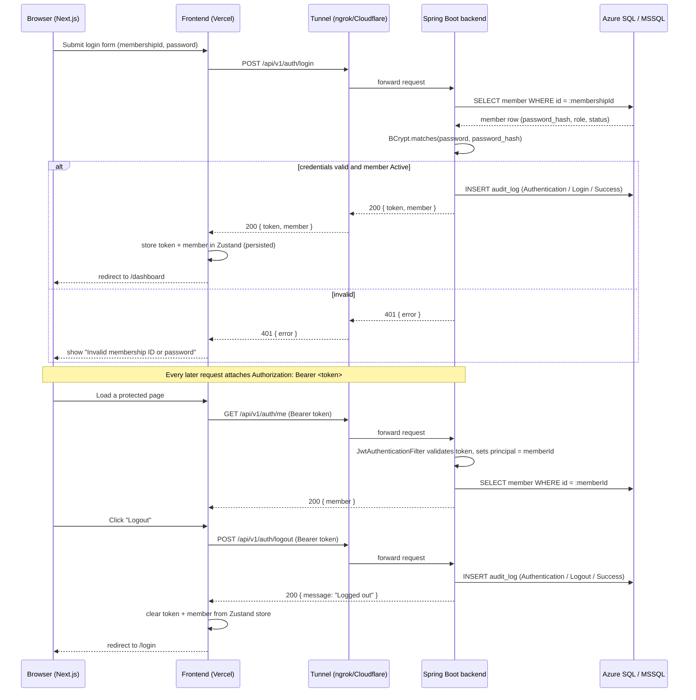
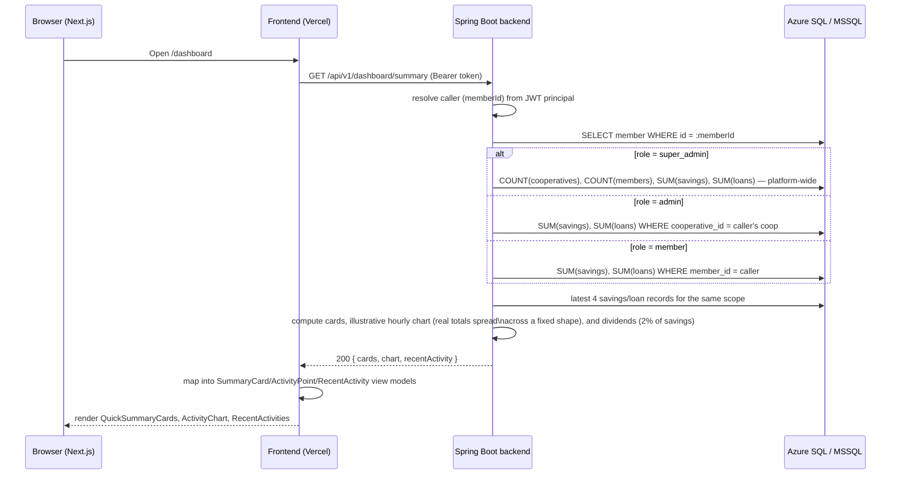
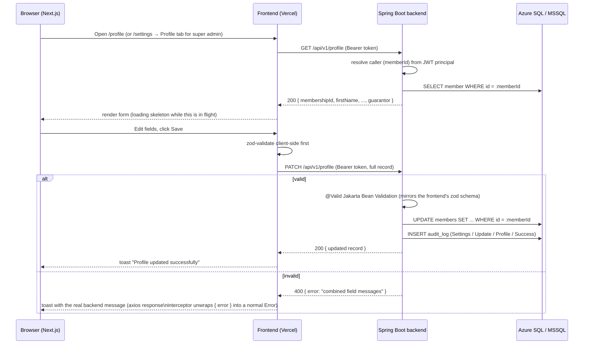
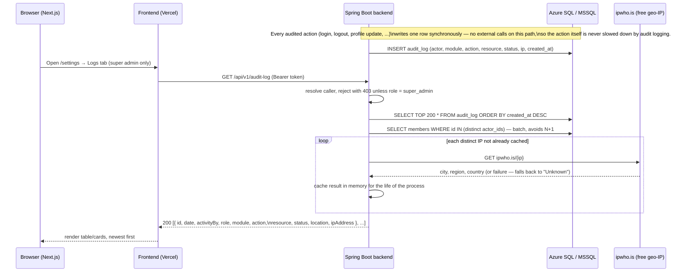

# Request flows

Sequence diagrams for the flows the frontend now calls for real:
authentication (login/me/logout), the dashboard summary, profile
view/edit, and the audit log.

## Auth flow

JWTs are stateless, so `/auth/logout` has nothing server-side to invalidate
today — it exists so logout is audit-logged and so the frontend always has
one call to make regardless of auth strategy. The token is discarded
client-side either way; if token revocation is ever needed, this endpoint is
where a blacklist check would be added.

**Any 401 from any endpoint (except `/auth/login` itself) forces the user
back to `/login`.** This is handled once, centrally, in the frontend's axios
response interceptor (`t-coop-app/src/lib/axios.ts`) — it clears the
Zustand auth store and hard-redirects, so an expired/invalid token on *any*
page (not just auth endpoints) recovers cleanly instead of showing a broken
page with failed requests. `/auth/login`'s own 401 (wrong password) is
excluded from this so a failed login attempt doesn't bounce the user in a
loop — that case is handled by the login form itself. This depends on 401
responses actually carrying CORS headers even when Spring Security
generates them directly (see api-conventions.md § CORS) — without that, the
browser reports a CORS failure instead of a 401 and this redirect never
fires.

## Dashboard summary flow

Cards and `recentActivity` are real aggregates over `savings_records` /
`loan_records`. The chart and "dividends" have no dedicated ledger yet —
see `schema-design.md` "What's deliberately not modeled yet" — so they're
derived from the real totals rather than invented outright: dividends is
2% of savings (matching the frontend's pre-existing `SAVINGS_EARNINGS_RATE`
convention) and the hourly chart distributes each real total across the
same illustrative daily shape the old frontend mock used.

## Profile view/edit flow

`/settings` → Profile tab (super admin only) edits a smaller subset of
fields than the full record (no NIN/bank account/gender/state/city) — the
frontend merges its edits onto the last-fetched full record before
sending the `PATCH`, so fields that tab doesn't show are never touched.
The `PATCH` request/validation on the backend is identical either way;
it doesn't know or care which UI sent it.

## Audit log flow

`module`/`action` values written anywhere in the backend **must** exactly
match the frontend's fixed `AuditModule`/`AuditAction` enums
(`t-coop-app/src/lib/audit-log-data.ts`) — this was a real bug once:
historical rows written before `ProfileController` used the right values
("Profile"/"Update Profile" instead of "Settings"/"Update") had no icon
mapping on the frontend and crashed the entire Logs tab. Fixed both ways —
the write side now uses the correct values, a migration corrected the
existing bad rows, and the frontend now falls back to a neutral icon for
any value it doesn't recognize instead of crashing, so a future mismatch
degrades gracefully instead of taking the page down.
