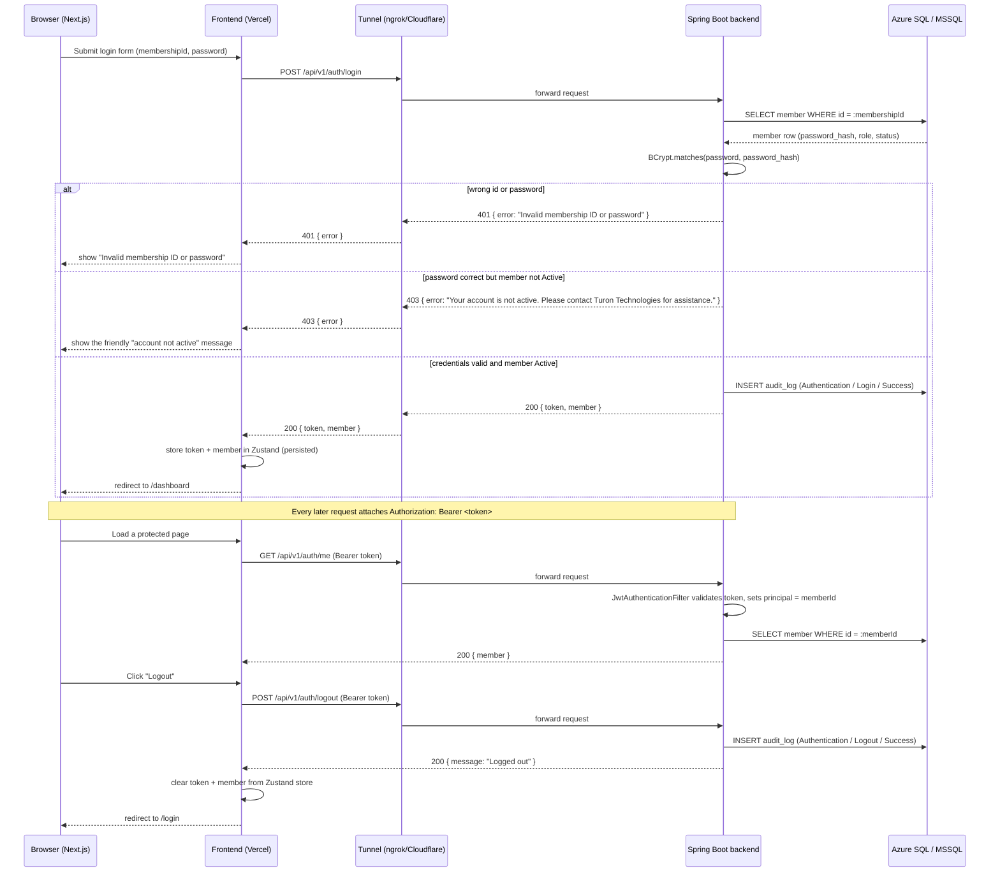
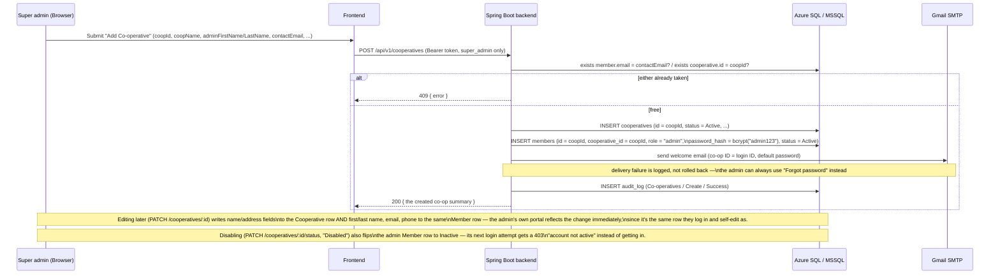
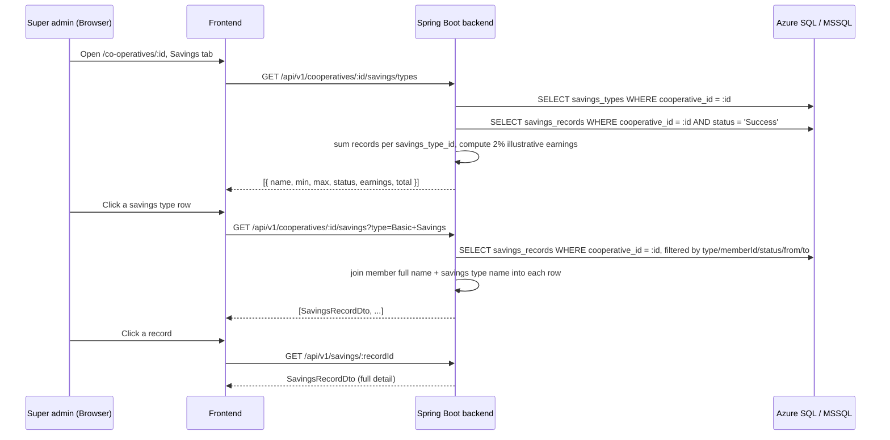
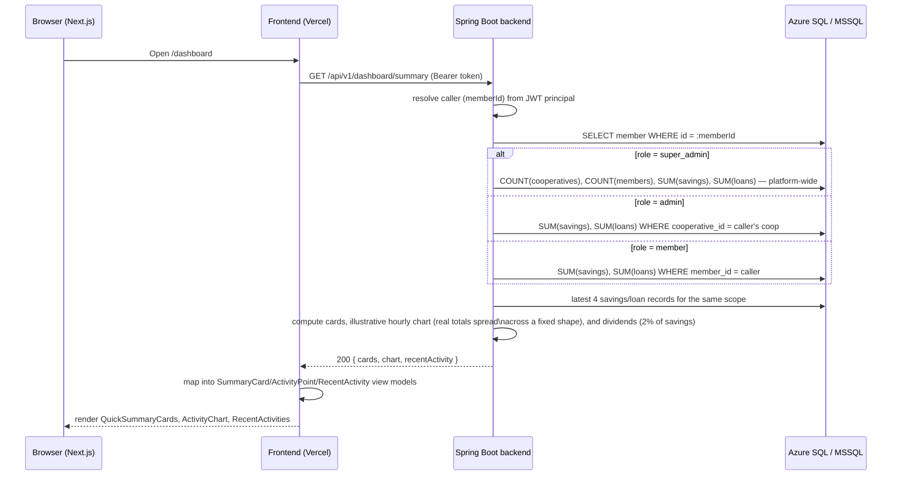
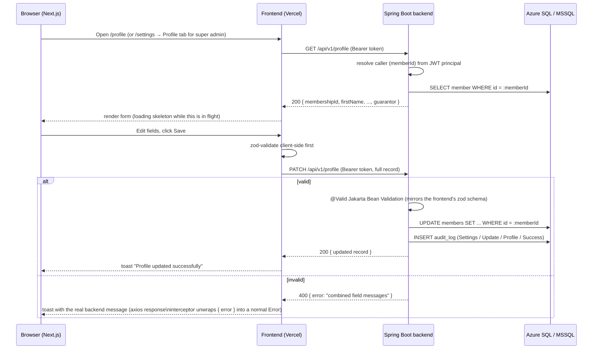
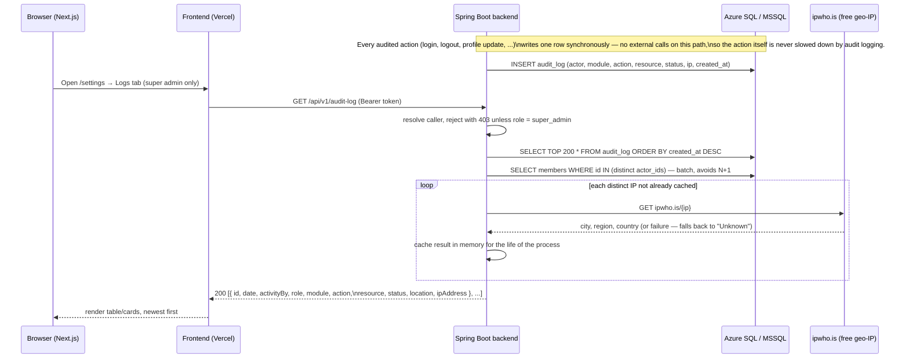

# Request flows

Sequence diagrams for the flows the frontend now calls for real:
authentication (login/me/logout), the dashboard summary, profile
view/edit, and the audit log.

## Auth flow



JWTs are stateless, so `/auth/logout` has nothing server-side to invalidate
today — it exists so logout is audit-logged and so the frontend always has
one call to make regardless of auth strategy. The token is discarded
client-side either way; if token revocation is ever needed, this endpoint is
where a blacklist check would be added.

**Any 401 from any endpoint (except `/auth/login` itself) forces the user
back to `/login`.** This is handled once, centrally, in the frontend's axios
response interceptor (`t-coop-app/src/lib/axios.ts`) — it clears the
Zustand auth store and hard-redirects, so an expired/invalid token on *any*
page (not just auth endpoints) recovers cleanly instead of showing a broken
page with failed requests. `/auth/login`'s own 401 (wrong password) is
excluded from this so a failed login attempt doesn't bounce the user in a
loop — that case is handled by the login form itself. This depends on 401
responses actually carrying CORS headers even when Spring Security
generates them directly (see api-conventions.md § CORS) — without that, the
browser reports a CORS failure instead of a 401 and this redirect never
fires.

## Co-operative onboarding flow

A co-op **is** its admin account — onboarding creates one `Cooperative` row and exactly one
`Member` row (`role: "admin"`) sharing the same `id`, so the co-op logs in as itself.



Nothing about this generates a second, separate `AD-XXXX` admin ID — the co-op ID *is* the
membership ID an admin logs in with, using the platform default password (`admin123`) until
they change it. This makes "how many co-ops has super admin onboarded" and "how many admin
accounts exist" the same number by construction, and every `Member` row with
`cooperativeId` = that co-op's id (role `admin` or `member`) is exactly that admin's roster.

## Subscription lifecycle flow

A co-op can act on the platform only while its subscription is paid up (`SubscriptionGateFilter`
enforces this on every mutating request platform-wide) — including a co-op that has *never*
paid, not just one that lapsed. There are two ways to pay: the super admin records a payment
they witnessed happen externally, or the co-op's own admin pays for real via Paystack/
Flutterwave/OPay from `/support` (the one page a dormant admin can still reach).

```mermaid
sequenceDiagram
    participant Admin as Co-op admin (Browser)
    participant F as Frontend
    participant B as Spring Boot backend
    participant GW as Paystack/Flutterwave (client-side widget)
    participant DB as Azure SQL / MSSQL

    Note over Admin,DB: Every write Admin attempts anywhere else in the app gets 402\n"subscription expired" from SubscriptionGateFilter until this succeeds.

    Admin->>F: Open /support, pick a plan (from the super admin's own Subscription\nPlans catalog) + gateway
    F->>B: GET /api/v1/subscriptions/me
    B->>DB: SELECT subscription_plans WHERE type = (New Subscription | Renewal) AND status = Active
    B-->>F: availablePlans (label/duration/amount, scoped to this co-op's state),\navailable gateways + PUBLIC keys (from PlatformSettings)

    Admin->>F: Click "Pay"
    F->>B: POST /api/v1/subscriptions/me/initialize { planId, gateway }
    B->>DB: INSERT subscription_payment_intents (reference, plan's own amount/label/duration, gateway, Pending)
    B-->>F: { reference, amount, publicKey }

    F->>GW: Open Inline checkout (publicKey, amount, reference)
    GW-->>Admin: Real checkout UI
    Admin->>GW: Pays
    GW-->>F: Client-side success callback (reference)

    F->>B: POST /api/v1/subscriptions/me/confirm { reference }
    B->>GW: GET transaction verify (reference) — server-side, using the SECRET key from PlatformSettings
    GW-->>B: { status: success, amount }
    B->>B: amount must be >= the intent's own amount — never trusts the client's number
    B->>DB: INSERT subscription_payments (type auto-detected: New Subscription | Renewal)
    B->>DB: UPDATE cooperatives SET subscription_cycle, subscription_expires_at
    B->>Admin: Emails a receipt (amount, type, cycle, next renewal date)
    B-->>F: SubscriptionReceiptDto
    F-->>Admin: Branded receipt (on-screen + downloadable PDF); dashboard's "expired" banner\nand /support redirect both clear on the next session refresh
```

**OPay is a third gateway option with a different shape from the diagram above** — it's
server-initiated/redirect-based, not a client-side inline widget:
- `POST /subscriptions/me/initialize { gateway: "Opay" }` has the *backend itself* call OPay's
  real `cashier/create` API and returns a hosted `checkoutUrl` instead of a `publicKey`.
- The frontend just navigates the browser to that `checkoutUrl` (`redirectToOpayCheckout` in
  `src/lib/opay.ts`) — there's no widget step, the payer leaves the app entirely.
- OPay redirects back to `{FRONTEND_URL}/support?opay_reference=...` once they're done;
  `AdminSupportView` picks the reference back up from the URL on mount and calls
  `POST /subscriptions/me/confirm` the same way the widget's success callback does for the
  other two gateways. `PaymentGatewayService.verifyOpay` does the server-side verification call.
- **OPay's two endpoints use two different auth schemes** — undocumented as a pair anywhere in
  OPay's own docs, only found by trial against their real sandbox API:
  - `cashier/create` (`createOpayCheckout`) takes the **raw public key** as the bearer token.
    Signing it (as `documentation.opaycheckout.com/api-signature` describes) produces a genuine
    `"Authentication failed"`.
  - `cashier/status` (`verifyOpay`) requires the **HMAC-SHA512-over-alphabetically-sorted-JSON**
    scheme that same page describes, signed with the secret key.
- **Currently wired to OPay's sandbox** (`testapi.opaycheckout.com`), not live — confirmed
  working end-to-end (`initialize` returns a real `checkoutUrl`; `confirm` correctly reaches
  `cashier/status` and reports "not successful" for an unpaid reference). Neither real merchant
  account available to this platform has finished OPay's live verification yet (both show
  "Test Mode, unverified" on their dashboards; live calls fail with an undocumented
  `{"code":"00003","message":"merchant is null"}`, not in OPay's own published error-code list).
  Switching to live later means updating `PaymentGatewayService.OPAY_BASE_URL` to the correct
  **per-country** live host — empirically, `liveapi.opaycheckout.com` for a Nigeria-registered
  merchant, `api.opaycheckout.com` for an Egypt-registered one (the wrong one for a given
  merchant 403s with a "request domain error" naming that merchant's actual country) — and
  re-confirming both endpoints' auth schemes still hold on live, since that was never checked
  there.

Key design points:
- **Pricing is a super-admin-managed catalog, not a formula.** `SubscriptionPlan` (Payment
  Settings → Subscription Plans) is freely addable/editable/deletable, with a flexible
  `durationInDays` (not a fixed Weekly/Monthly/Quarterly/Yearly enum) and separate prices for
  New Subscription vs. Renewal. `GET /subscriptions/me` only ever offers `Active` plans of the
  type matching this co-op's current state.
- **Never trust a client-supplied amount.** `initialize` is the only place a price is decided
  (straight from the chosen plan), and `confirm` re-verifies against the real gateway API
  before ever writing a `subscription_payments` row — a manipulated checkout amount can't sneak
  a cheap plan past the system.
- **Keys come from `PlatformSettings`, never a static env var.** `PaymentGatewayService` reads
  whatever the super admin entered in Settings → Integrations at the moment of verification —
  same discipline the frontend's `/support` page follows for the public key it hands to
  Paystack/Flutterwave's own checkout widget (OPay's secret key stays server-side only, used to
  sign the `cashier/create`/`cashier/status` calls directly — its "public key" is stored for
  parity with the other two gateways but isn't actually used by OPay's own API).
- **`SubscriptionGateFilter` exempts every `/api/v1/subscriptions/me/**` route** specifically so
  a fully-locked-out admin can still reach the one path that unlocks them.
- **Every receipt is regenerable, not stored as a file** — `SubscriptionPayment.resultingExpiresAt`
  (captured at the time, not read live off the co-op) is enough to rebuild an identical receipt
  for any historical payment from `/support`'s transaction history, weeks or years later.
- **The super admin's manual-entry path (`POST /cooperatives/:id/subscriptions`) and this
  self-service path both funnel through the same `applyPayment(...)` method** — one place decides
  what "recording a payment" means, whether the money was witnessed externally or verified live.

## Savings oversight flow (super admin only)

`SavingsController` backs the "Savings & Contributions" tab on a co-op's detail page — the
`/co-operatives/[id]/savings/...` routes — and `CooperativeController.members` backs that same
page's Members tab (`GET /cooperatives/:id/members`). **Read-only, super-admin only**, and
deliberately scoped that way: the flows that actually *create* a savings record (an admin's
"Upload Teller", a member's real Paystack "+ New Savings") or edit a member's profile/status
haven't been cut over from the frontend's mock `useCoopStore` to this backend yet — see
`t-coop-app/documentation/savings-page.md`. These controllers only read whatever's already in
`members`/`savings_records`/`savings_types` — a member's id/name is joined into each savings row
from the exact same `Member` rows the Members tab lists, so the two tabs can never disagree with
each other or with the platform-wide `/savings` oversight page (both ultimately trace back to
`GET /cooperatives`, `GET /cooperatives/:id/members`, and the savings endpoints below — no
separate or cached copy of a co-op's identity anywhere in this flow).



Key design points:
- **No invented data — a co-op has zero savings types until someone deliberately configures
  one.** An earlier version of this feature auto-seeded every co-op with a Basic/Advanced/Premium
  trio copied from the frontend's old hardcoded `SAVINGS_TYPES` catalog — on creation
  (`CooperativeController`) and via a one-time backfill (`V15__backfill_savings_types.sql`) for
  co-ops that already existed. That was explicitly rejected: a super admin should never see a
  savings-type name on this page that they didn't actually put there themselves.
  `V16__remove_invented_savings_types.sql` deleted every one of those invented rows (every real
  co-op except `COOP-0001`, whose Basic/Advanced/Premium rows predate this feature entirely —
  hand-seeded in V3 as real demo data, not part of the backfill). `GET
  /cooperatives/:id/savings/types` now legitimately returns `[]` for a co-op with none —
  the frontend's empty-state message ("No savings types configured") is the honest, correct
  outcome, not a bug to paper over with fake defaults.
- **Per-co-op configurable, not a hardcoded global enum** — `savings_types` has always had a
  `cooperative_id` column (V1). There's no management UI yet to actually create/edit a co-op's
  own types, but the data model already supports it — a future task, not a redesign.
- **"Earnings on Savings" is illustrative, not a real accrual engine** — a flat 2% of a type's
  total, same honesty note as the dashboard's dividends figure and the frontend's own
  pre-existing `SAVINGS_EARNINGS_RATE`. Nothing in this codebase pays real savings interest yet.
- **A withdrawal is a negative-amount record, not a separate shape** — `SavingsRecord.amount`
  can be negative; every sum here is a plain arithmetic sum, so a withdrawal nets out of a type's
  total automatically, no special-casing. (No endpoint here *creates* one yet — this is purely
  what gets read back once one exists.)
- **Money in `Pending`/`Failed` status is excluded from every total.** Only `Success`-status
  records count toward a savings type's `total`/`earnings` — matches the same discipline
  `SavingsRecordRepository.sumByCooperative` (used by `CooperativeSummaryDto.totalSavings`)
  already applied.

## Members oversight — now read/write, not read-only

`CooperativeController` also backs the co-op detail page's Members tab: `GET
/cooperatives/:id/members` (list — was already read-only), plus three more that make it a real
management surface, not just a mirror: `POST /cooperatives/:id/members` (add a member — same
onboarding convention as a co-op's own admin: caller picks the membership ID, account starts
with the platform default password `admin123`, a welcome email goes out with those credentials),
`PATCH /cooperatives/:id/members/:memberId` (edit profile), `PATCH
/cooperatives/:id/members/:memberId/status` (Active/Inactive). All four share one auth rule
(`requireCoopAccess`): `super_admin` can act on any co-op; `admin` only their own, checked
against their own `cooperativeId` server-side — the path's `{id}` is never trusted on its own for
an `admin` caller. The frontend's `CoopMembersTable`/`EditMemberModal` used to show a "Coming
soon" toast for Edit/Disable against real data — that placeholder is gone now that these
endpoints exist.

## Loans oversight flow (super admin only) — mirrors Savings exactly

`LoanController` is `SavingsController`'s counterpart: `GET /cooperatives/:id/loans/types` (the
"Loans" breakdown table — eligibility/duration/interest from the co-op's own `loan_types` row,
"Earnings on Loan" aggregated live as `sum(totalRepayment - amount)` over every non-`Rejected`
loan of that type — real interest collected, not an illustrative flat rate like Savings' 2%),
`GET /cooperatives/:id/loans` (per-co-op record list, filterable by `memberId`/`type`/`status`/
`from`/`to`), `GET /loans/:recordId` (single-record detail). Same read-only-by-design scoping as
Savings: the flows that actually *create* a loan record (a member's request, guarantor
acceptance, admin approval/disbursement) haven't been cut over from the frontend's mock store —
see `t-coop-app/documentation/loans-page.md`.

**Loan types ARE seeded, unlike savings types — a deliberate, different choice, not an
inconsistency.** `V17__seed_loan_types.sql` gave every real co-op the same three products
(Emergency/Education/Business Loan, matching `COOP-0001`'s own pre-existing V3 values) as an
explicit one-time backfill, requested directly rather than invented on the fly. Critically,
`CooperativeController` does **not** auto-seed loan types on new co-op creation — the same
lesson from the savings auto-seed reversal (V15/V16) still applies going forward: a co-op
onboarded after V17 ran starts with zero loan types until someone seeds/configures them
explicitly, same honest-empty-state discipline as savings types.

## Dashboard summary flow



Cards and `recentActivity` are real aggregates over `savings_records` /
`loan_records`. The chart and "dividends" have no dedicated ledger yet —
see `schema-design.md` "What's deliberately not modeled yet" — so they're
derived from the real totals rather than invented outright: dividends is
2% of savings (matching the frontend's pre-existing `SAVINGS_EARNINGS_RATE`
convention) and the hourly chart distributes each real total across the
same illustrative daily shape the old frontend mock used.

## Profile view/edit flow



`/settings` → Profile tab (super admin only) edits a smaller subset of
fields than the full record (no NIN/bank account/gender/state/city) — the
frontend merges its edits onto the last-fetched full record before
sending the `PATCH`, so fields that tab doesn't show are never touched.
The `PATCH` request/validation on the backend is identical either way;
it doesn't know or care which UI sent it.

**Password change** (`POST /api/v1/profile/password`, same Settings tab)
is a separate call, sent *after* the profile-fields `PATCH` succeeds: verify
`currentPassword` against the stored bcrypt hash (400 if it doesn't match),
re-hash and save `newPassword`, audit-log (`Settings` / `Update` /
`Password`). Sequencing it after the profile save means a password-change
failure never loses the profile edits that already succeeded — the frontend
shows "Profile details saved" plus an inline error scoped to the password
fields, not a single failure toast that would wrongly imply nothing saved.

## Audit log flow



`module`/`action` values written anywhere in the backend **must** exactly
match the frontend's fixed `AuditModule`/`AuditAction` enums
(`t-coop-app/src/lib/audit-log-data.ts`) — this was a real bug once:
historical rows written before `ProfileController` used the right values
("Profile"/"Update Profile" instead of "Settings"/"Update") had no icon
mapping on the frontend and crashed the entire Logs tab. Fixed both ways —
the write side now uses the correct values, a migration corrected the
existing bad rows, and the frontend now falls back to a neutral icon for
any value it doesn't recognize instead of crashing, so a future mismatch
degrades gracefully instead of taking the page down.

## Platform settings flow (Fees & Charges / Account Details / Integrations)

Same shape as the profile flow above, three times over — `GET`/`PATCH`
`/api/v1/settings/fees`, `/settings/collection-account`, and
`/settings/integrations` each read/write one singleton row
(`platform_fee_settings`, `id = 1`), gated to `super_admin` only (403
otherwise, checked in `PlatformSettingsController` the same way
`AuditLogController` checks it — never just hidden in the UI). Each
successful `PATCH` audit-logs `Settings` / `Update` / one of `Fees & Charges`
/ `Collections Account` / `Integrations`. The Integrations credentials are
saved and returned as plain text (matching the frontend's prior in-memory
mock behavior) but are never read by the live Paystack integration, which
always uses the server's own `PAYSTACK_SECRET_KEY` environment variable —
see the javadoc on `IntegrationSettingsUpdateRequest` before wiring these
saved values into anything that actually moves money.

## Notifications and Notice Board flow (built 2026-08-24)

Two things landed together in the same session because they're coupled: a generic
per-recipient notification feed (didn't exist on the backend at all before this), and turning
Notice Board from a per-browser `localStorage` mock into a real, tenant-isolated feature —
Notice Board posts are the flow that most directly needed real notifications to mean anything
("the right people get the right notification" is impossible if "the right people" only means
"other tabs in the same browser").

**Why fan-out happens at write time, into one row per recipient, instead of a shared broadcast
row.** The alternative — one notification row plus a separate "who's read it" join table — is the
more normalized design, and was rejected on purpose: with one row per recipient, tenant isolation
is structural (a query for "my notifications" is just `WHERE recipient_member_id = me`, there is
no row that could theoretically belong to someone else), and read/unread state is a single boolean
column with no join needed. The cost is some write amplification when a notice targets "All
Members & Admins" across a large co-op — judged worth it for the isolation guarantee, given the
user's explicit requirement that co-op A's events must never be visible to co-op B "only if super
admin passes the same message to all of them."

**Trigger points, all going through the same `NotificationService`:**

| Event | Where it's hooked | Recipient(s) |
|---|---|---|
| Subscription renewed (manual or self-service) | `SubscriptionController.applyPayment` (the one method both `recordPayment` and `confirmPayment` funnel through) | Co-op's admin only |
| Subscription expiring within 7 days | `SubscriptionExpiryReminderJob`, daily 08:00 UTC | Co-op's admin only |
| Subscription already expired | Same job, separate notification type, fires once per lapse | Co-op's admin only |
| Notice Board post created/resent | `NoticeController.fanOutNotifications`, keyed on the notice's `recipient` field | Per notice's own targeting — admin only / members only / everyone, per targeted co-op(s) |
| Co-op onboarded | `CooperativeController.create` | The new admin |
| Co-op enabled/disabled | `CooperativeController.updateStatus` | That co-op's admin |
| Member added | `CooperativeController.addMember` | The new member |
| Member activated/disabled | `CooperativeController.updateMemberStatus` | That member |
| Platform-staff invite accepted | `PlatformInviteAcceptController.accept` | Every `super_admin` |

Why the recipient choice for subscription notifications is admin-only, not the whole co-op: the
admin is the only one with agency to act on it (they're the one who sees the Subscriptions/Support
page and can pay), and members can't do anything about a subscription state — a deliberate,
user-confirmed scope decision, not an oversight.

**`SubscriptionGateFilter` had to learn about `/notifications/**`.** It was already exempting
`/subscriptions/me/**` so a dormant co-op's admin could pay their way back in; without the same
exemption for notifications, that same admin couldn't even mark their own "your subscription
expired" notification as read — caught by testing, not by inspection, and fixed the same session.

**Notice Board's tenant isolation, concretely:** every notice has a required, non-empty
`targetCoopIds` (no "empty means broadcast to everyone" fallback the old mock had). An admin's
`targetCoopIds` in a create request is silently overridden to `[their own cooperativeId]` server
side — sending someone else's co-op id in the request body does nothing. `NoticeController
.isVisible` is the single gate every read/reply/resend/delete goes through, mirroring the old
frontend-only `isNoticeVisibleToRole`/`noticeTargetsCoop` pair but now enforced once, server-side,
instead of duplicated (and therefore riskier to keep in sync) across every page that read notices.

**Attachments moved off base64.** The old mock inlined a file as a base64 `data:` URL directly in
the notice record; a new `POST /uploads/attachment` endpoint (Cloudinary, `resource_type: auto` so
PDFs/Word docs work) returns a real hosted URL instead, stored in `notices.attachment_url`. Same
2MB cap as before, now a deliberate server-side limit rather than an artifact of `localStorage`'s
quota.

See `documentation/api-contracts.md` sections 7, 11, and 14 for the full endpoint contracts.

### Real Email/SMS delivery for Notice Board (built same day, later in the session)

The in-app notification above always fires regardless of a notice's `medium`; Email and SMS are
additional, best-effort delivery on top of it, added once the notification system itself was
proven working.

- **Email** — `EmailService.sendNoticeEmail`, no new infrastructure: reuses the same Gmail SMTP
  path already proven for OTP/welcome/receipt emails. Fires whenever `medium` includes "Email".
- **SMS** — genuinely new: `SmsService` (`com.turontechnologies.tcoop.notice`), calling Termii's
  REST API (`https://api.ng.termii.com/api/sms/send`) via plain `java.net.http.HttpClient`, same
  style as `PaymentGatewayService`'s Paystack/Flutterwave verification calls. Termii was picked
  for its free trial credit and Nigeria-first fit (matches the platform's existing NGN/Paystack/
  OPay-first design) — the user explicitly asked for "something free for now." Credentials
  (`smsApiKey`, `smsSenderId`) live on the same `PlatformSettings` singleton as the payment
  gateways (`V21__sms_integration.sql`), read live, never a static env var.
- **Both are best-effort, in `NoticeController.fanOutNotifications`**: a failure (bad credentials,
  Termii rejecting the send, network error) is logged and never blocks the notice or its in-app
  notification. Real-world testing against the user's actual Termii account hit
  `SENDER_ID_NOT_APPROVED` — the platform's Termii workspace has no approved Sender ID yet. This
  is a Termii-dashboard step for the user (register or find their assigned Sender ID, then set it
  in Settings → Integrations → SMS → Sender ID), not a code problem — the request/response/error
  handling all verified correct via the real error Termii returned.
- **A real mistake happened and was caught mid-session**: a test `PATCH /settings/integrations`
  call sent a fresh payload instead of GET-then-merging onto the existing saved settings, briefly
  wiping the user's just-saved real Paystack/Flutterwave keys. Caught immediately (the values were
  still visible in the preceding GET call's output) and restored in the very next call — verified
  correct afterward. Lesson for next time: **never PATCH a shared settings resource with a
  fresh/test payload without first GETting current state and merging onto it** — even a "just
  testing" call is a real write against real saved data.
- Phone numbers are normalized to Termii's expected shape (`SmsService.normalizePhone` — handles
  `0801...`, `+234801...`, and `234801...` input shapes, all common in this app's `Member.phone`
  field) before sending.
