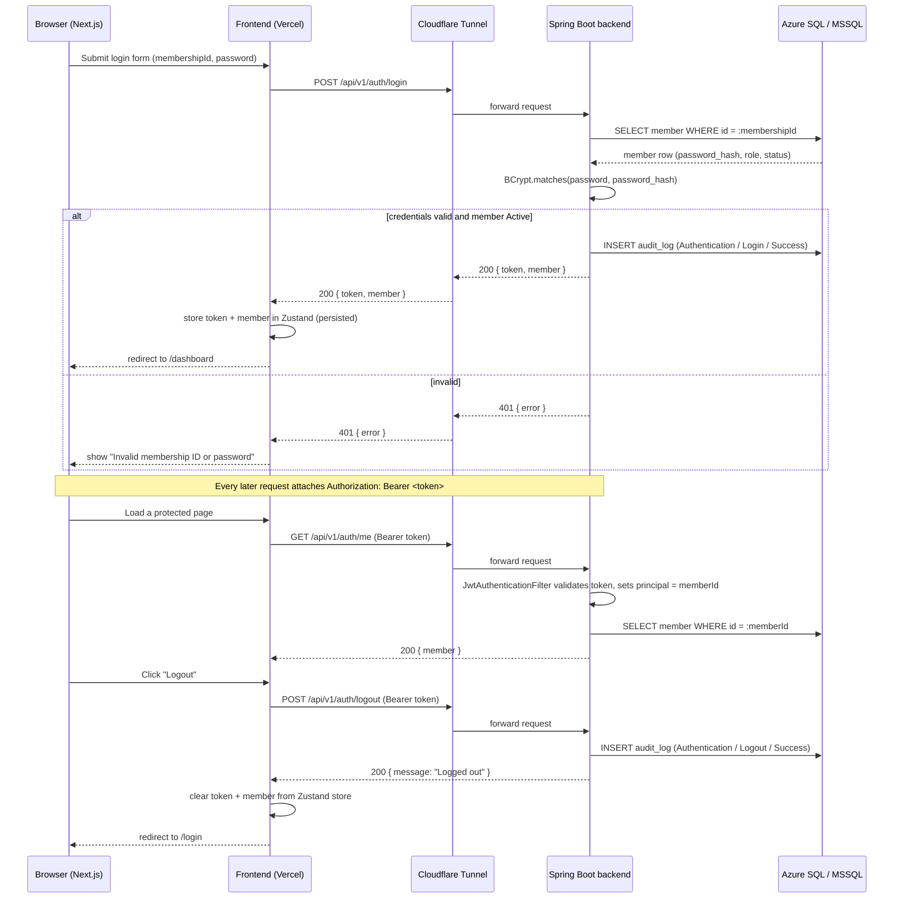
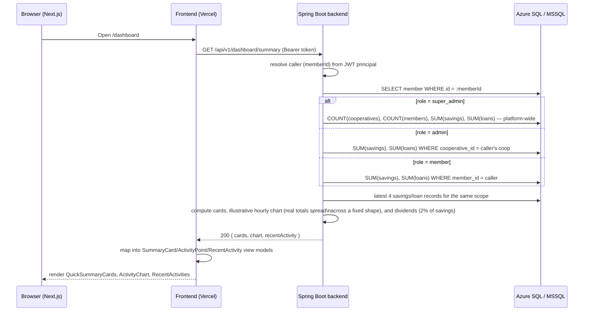

# Request flows

Sequence diagrams for the two flows the frontend now calls for real:
authentication (login/me/logout) and the dashboard summary.

## Auth flow

JWTs are stateless, so `/auth/logout` has nothing server-side to invalidate
today — it exists so logout is audit-logged and so the frontend always has
one call to make regardless of auth strategy. The token is discarded
client-side either way; if token revocation is ever needed, this endpoint is
where a blacklist check would be added.

## Dashboard summary flow

Cards and `recentActivity` are real aggregates over `savings_records` /
`loan_records`. The chart and "dividends" have no dedicated ledger yet —
see `schema-design.md` "What's deliberately not modeled yet" — so they're
derived from the real totals rather than invented outright: dividends is
2% of savings (matching the frontend's pre-existing `SAVINGS_EARNINGS_RATE`
convention) and the hourly chart distributes each real total across the
same illustrative daily shape the old frontend mock used.
