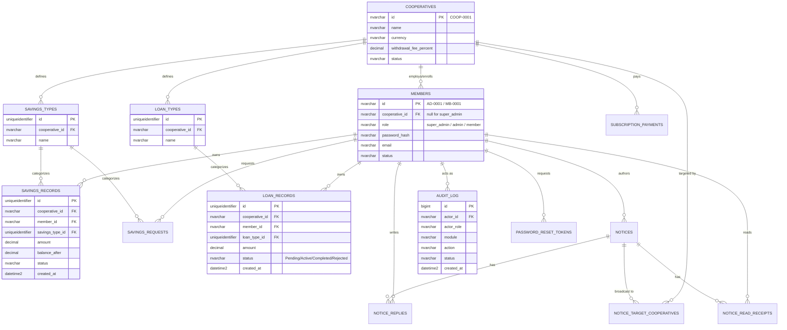

# Database Schema Design

Source of truth: [`api-contracts.md`](./api-contracts.md) (the frontend
engineer's spec of every endpoint the real backend needs to serve) plus the
existing frontend mock data models (`t-coop-app/src/lib/*-data.ts`), which
this schema mirrors so the eventual mapping between "what the mock did" and
"what the real database does" stays obvious.

Implemented as [`V1__init_schema.sql`](../src/main/resources/db/migration/V1__init_schema.sql).

## ID strategy

- **Business-assigned, human-meaningful IDs stay as the primary key** and
  are `NVARCHAR`, not surrogate ints — `cooperatives.id` (`COOP-0001`),
  `members.id` (`AD-0001`, membership ID doubles as the login ID and the PK).
  These are IDs a human reads, types, or references in support conversations.
- **Everything else uses `UNIQUEIDENTIFIER` (GUID), server-generated**
  (`DEFAULT NEWID()`) — savings records, loan records, notices, requests,
  replies, etc. The mock generates these as `sav-${Date.now()}`, which
  collides under concurrent writes; a real backend shouldn't inherit that.
- Join/log tables use a surrogate `BIGINT IDENTITY` since nothing ever
  references them by ID from outside.

## Entity relationship diagram

## Tables

### `members`
One table for all three roles (`super_admin`, `admin`, `member`) — matches
`AuthenticatedMember` plus the full profile fields from `GET /profile`.
`cooperative_id` is null for `super_admin` (platform-wide), set for
`admin`/`member` (scoped to one co-op). Password is stored as a hash
(`password_hash`), never plaintext — the current mock's plaintext
`mock-users.ts` is exactly what this replaces.

### `cooperatives`
One row per co-op. `admin_name`/`contact_email` etc. are kept as plain
columns (matching the mock) rather than always joining to `members` —
simpler for the list endpoint that needs to return them directly.
`currency` (ISO 4217) and `withdrawal_fee_percent` live here per the
currency-conversion and withdrawal-fee features already built on the
frontend.

### `savings_types` / `loan_types`
Per-co-op catalogs (an admin can create their own types, not just a fixed
global list — see the frontend's admin-settings work). `loan_types` also
carries the approval workflow fields (`approver1_id`, `approver2_id`,
`loan_terms`, `guarantor_terms`).

### `savings_records`
One row per deposit/withdrawal that's actually happened.
`balance_after` is computed server-side at write time (never trust a
client-supplied balance).

### `savings_requests`
Pending/resolved member-initiated deposit or withdrawal requests, before
they become a `savings_records` row. `savings_type_id` is nullable —
null means "Total Savings" (spread across all the member's types on
approval — see the frontend's withdrawal waterfall logic). Carries the
withdrawal fee breakdown (`fee_percent`, `fee_amount`, `net_amount`),
locked in at request time.

### `loan_records`
One row per loan application/loan. Repayment schedule is **computed**,
not stored (same as the mock) — `repayments_made` plus the loan's own
amount/duration/total fields are enough to derive the full schedule
on demand. A real "record a repayment" endpoint is a known open
question (flagged in `api-contracts.md` §6) — deferred until product
decides the model (auto-deduct vs. admin-recorded).

### `notices` / `notice_target_cooperatives` / `notice_replies` / `notice_read_receipts`
A notice can target more than one co-op (super admin picks which
onboarded co-ops it's addressed to) — that's a many-to-many, hence the
join table `notice_target_cooperatives`. No rows in that table = platform-
wide broadcast (matches the frontend's `noticeTargetsCoop` "empty means
everyone" rule). Read receipts are per-member so "read" state follows the
person across devices, not just the browser's localStorage like the mock.

### `subscription_payments`
One row per manual subscription payment recorded for a co-op. Standing
(`Active`/`Overdue`) is the most recent payment's status — no separate
"standing" table needed.

### `platform_fee_settings`
Singleton row (`id = 1`) for super-admin-level settings: the platform's
own withdrawal fee percent, savings/loan charge config, collections bank
account (`collection_*` columns, added in V6), and Paystack/Flutterwave
credential fields (`paystack_*`/`flutterwave_*`, also V6 — stored for
reference only, never read by the live Paystack integration, which always
uses the server's own `PAYSTACK_SECRET_KEY` env var). Enforced as a single
row via a check constraint, not a real multi-tenant table — there's one
platform.

### `password_reset_tokens`
Backs the forgot-password/OTP/reset flow (`api-contracts.md` §1) properly
server-side — OTP is hashed, never returned in a response (unlike the
current mock, which is explicitly flagged as a gap to close).

### `audit_log`
Matches the frontend's existing audit-log feature (`module`, `action`,
`resource`, `status`, actor, IP, timestamp) — every admin-facing mutation
writes one row here.

## What's deliberately not modeled yet

- **File storage** — `attachment_url` / `receipt_url` / `document_url`
  columns store a URL (Cloudinary), not file bytes. The backend's
  `/api/uploads` endpoint (already built) is what produces that URL.
- **Loan repayments as a real ledger** — see `loan_records` note above.
- **Multi-tenant `platform_fee_settings`** — single row by design; revisit
  only if T-Coop ever hosts more than one platform instance.
